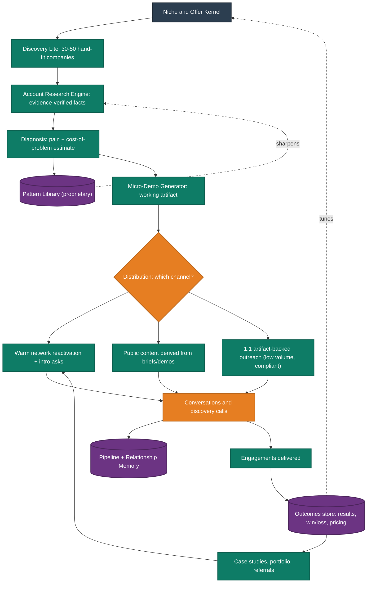
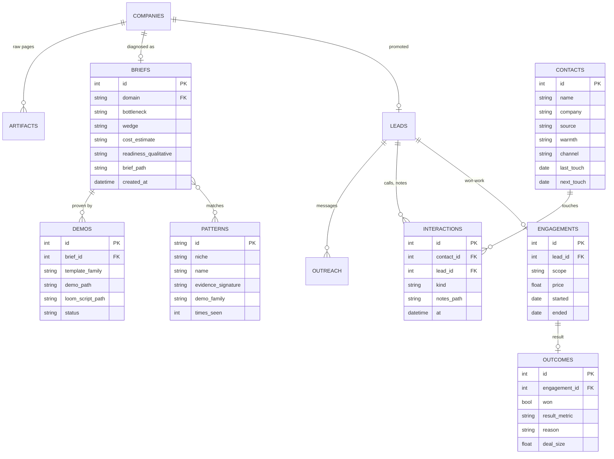
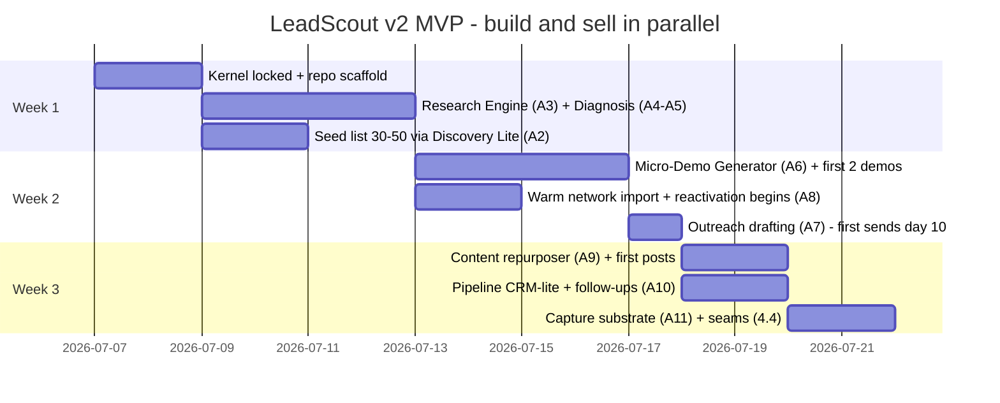

# LeadScout v2 — AI Consulting Intelligence Platform
## Final Specification (supersedes leadscout-spec-v1.md — V1 is absorbed, not discarded)

| | |
|---|---|
| **Document** | Final platform specification: business architecture → module registry → engineering → roadmap |
| **Owner / Operator** | Solo AI engineer, international consulting, budget ~₹1,000/mo API + Claude Code |
| **Audience** | Claude Code (builder) and the operator |
| **Status** | Approved for build. Decisions are final; every module carries its justification |
| **Inputs synthesized** | V1 spec · Teardown report · Moats/segments report · CPO architecture decision · Founder review |
| **Scope legend** | ✅ committed in current build window · ⚠️ deferred (build trigger stated inline) |
| **Prime directive** | Goal A: consulting revenue as fast as possible. Goal B: proprietary consulting intelligence that compounds for years. Neither may significantly damage the other. |

---

## 1. The decision

**LeadScout is no longer a lead machine. It is the internal operating system of a consulting company** — a Proof & Trust engine wrapped around a compounding intelligence store. The name stays; the center of gravity moves.

The thesis flip, stated once: for funded-startup buyers, **conversion is gated by niche, proof, and trust — not by lead volume**. Cold reply rates (~3.4% median, falling) punish exactly the scale motion V1 optimized. The operator's unfair advantage is being a real engineer who can hand a founder a working artifact built for *their* problem. So the core engine is **one company in → diagnosis + costed pain + tailored micro-demo out**, distributed through warm network, public content, and low-volume 1:1 outreach.

**Nothing from the four documents is deleted.** Per the founder correction, every module is classified, not killed:

| Category | Meaning | Discipline |
|---|---|---|
| **A — Core MVP** | Must exist immediately; directly produces revenue motion or captures moat data | Build in the 3-week window |
| **B — Architecture Reserved** | High value, wrong time. Interfaces, schema, and folder stubs exist NOW; implementation waits for a stated trigger | Designing the seam costs hours; keeps evolution cheap |
| **C — Future Intelligence** | Cannot exist without accumulated engagement data. The *capture substrate* is Category A; the *intelligence* arrives when n is large enough | Capture from day 1, mine later |
| **D — Experimental** | Optional ideas kept alive, revisited at phase gates | Never blocks A–C |

**Never Build** is used exactly twice in this document (§3.5), each with overwhelming evidence.

Where the four inputs conflicted, this spec rules as follows: the teardown's channel evidence stands (warm > content/community > targeted 1:1 ≫ mass); the CPO's 3-week core stands (Kernel → Brief → Demo → Distribution); the founder correction overrules both wherever they said "delete" — scoring, dashboard, CRM, browser agents, proposal engine, knowledge graph all survive as B/C/D with triggers; and V1's engineering assets (evidence-verified extraction, compliance layer, polite crawling, SQLite spine, LLM cache) are retained because they are channel-agnostic infrastructure, not artifacts of the old thesis. One deliberate overrule of the CPO document: **the pipeline/CRM stays custom (SQLite), not Notion/HubSpot** — because outcome capture is the substrate every Category C module depends on, and data you don't own can't compound (justification in §3.1, Module A10).

---

## 2. Business architecture

### 2.1 The trust funnel and its feedback loop

The platform is a loop, not a pipeline. Every pass through it produces (a) a chance at revenue and (b) proprietary data that makes the next pass sharper.



The two dotted edges are the whole company: outcomes re-tune the offer, and accumulated patterns make every future brief cheaper and sharper.

### 2.2 The moat — what actually compounds

Ranked from the workflow evidence (commodity → durable). The platform's design principle: **spend engineering on rows 5–8, treat rows 1–4 as thin utilities.**

| Rank | Asset | Verdict | Captured by |
|---|---|---|---|
| 1 | Lead lists / sourcing | Commodity, decaying | Discovery Lite (thin) |
| 2 | Enrichment data | Commodity (rentable by anyone) | Utilities only |
| 3 | Outreach sending | Commodity, degrading channel | Manual sends now |
| 4 | Follow-up mechanics | Commodity tech, rare discipline | Pipeline reminders |
| 5 | **Pain patterns per niche** (from real research + calls) | Semi-durable → durable with n | Pattern Library (A11) |
| 6 | **Proposal outcomes** (what scope/price/framing closed) | Durable, fully proprietary | Outcomes store (A11, C modules) |
| 7 | **Demo/delivery IP** (reusable per-niche templates) | Durable — requires engineering skill | Demo templates (A6) |
| 8 | **Delivered results → reputation** (case studies, referrals) | Most durable; cannot be scraped or bought | Case Study Engine (B), content |

### 2.3 Phase evolution and what the platform becomes


**At 5 clients** the platform is a **proof-driven sales engine**: 3+ case studies, an offer re-priced on real win/loss, briefs half-prewritten by the pattern library, the proposal generator live. Its job shifts from "find reasons to talk" to "convert reputation into calls."

**At 20 clients** it is a **consulting operating system and agency substrate**: pricing tuned by outcome data, a discovery-call assistant trained on your own transcripts of what worked, delivery playbooks generated from engagement notes, and lead scoring finally justified because inbound + referral volume exceeds what you can read manually. Contractors run *your system*; the system is the quality control.

**At 100 clients** the intelligence **is** the product: a proprietary dataset of pain patterns × proposals × prices × outcomes per niche that no competitor can observe. Phase 5–6 productize slices of it — the most-repeated micro-demo becomes the product wedge; the pattern library becomes benchmarks; the buying-trigger monitor (the original LeadScout thesis, returning at the right time with real budget) becomes a SaaS feature. Distribution is the reputation the consulting years built.

### 2.4 Channel policy (binding)

1. **Warm network first** — highest-converting channel for this segment; costs nothing; tracked, not automated.
2. **Public content second** — every brief/demo is repurposed into a niche post; reputation is the inbound engine and Phase 5–6 distribution.
3. **Targeted 1:1 outreach third** — low volume (≤ 10/day), artifact-anchored, fully compliant per §4.6. Every message references a verified fact and, where possible, carries a demo.
4. **Mass outreach: never** (§3.5).

---

## 3. Module registry — every module, one decision each

Vocabulary for build timing: **Build Now · Minimal Placeholder · Architecture Reserved · After First Client · After 10 Clients · After 50 Clients · Product Phase · Never Build.**

### 3.1 Category A — Core MVP (all ✅ Build Now)

Repeating unit: **Purpose · Why now · Feeds · Business value · Proprietary/compounds · V1 reuse.**

**A1 — Niche & Offer Kernel** (`kernel/`, config not code)
Purpose: lock ONE ICP, ONE costed recurring problem, offer-as-a-number, 3 disqualifiers. · Why now: every downstream artifact's quality is a direct function of niche sharpness; without it the platform generates polished garbage. · Feeds: literally every module. · Value: makes artifacts read as insider work; collapses "why you." · Proprietary: the niche thesis itself, re-tuned by outcomes (§2.1 dotted edge). Compounds: narrow reputation compounds; broad dilutes. · V1 reuse: none (new).

**A2 — Discovery Lite** (the module that keeps the LeadScout name)
Purpose: assemble and refresh a hand-fit list of 30–50 target companies in-niche. Thin adapters: HN Who-is-hiring + YC index + manual adds; careers-page fetch for candidates. · Why now: the funnel needs input, but finding is a commodity — so it gets days, not weeks. · Feeds: A3. · Value: keeps the brief engine fed without eating the build window. · Proprietary: no (deliberately). · V1 reuse: HN/YC adapters, `polite_fetch()`, normalization, prefilter — scope capped; EDGAR adapter moves to B.

**A3 — Account Research Engine** (Company Intelligence + Business Understanding)
Purpose: one company in → structured, evidence-verified fact base out (site, careers, docs, GitHub, public funding traces). Script/API-first; browser only as fallback (B7). · Why now: raw material for diagnosis, demos, outreach, and meeting prep — the single highest-reuse artifact. · Feeds: A4, A6, A7, B4. · Value: walking into any conversation knowing their business cold. · Proprietary: research corpus accumulates per niche. Compounds: yes — brief #40 in a niche is half-prewritten. · V1 reuse: crawler, artifact store, **the verbatim-evidence validation rule (kept, non-negotiable)**, LLM router + cache.

**A4 — Pain Detection & Diagnosis** (Pain Detection + Opportunity Analysis + AI-Readiness-qualitative)
Purpose: map verified facts → the niche's known pain patterns → the specific bottleneck, the wedge, and a qualitative AI-readiness read. · Why now: this is the differentiation — diagnosis, not signals. · Feeds: A5, A6, A7, Pattern Library. · Value: converts "a company" into "a reason to talk today." · Proprietary: **yes — every diagnosis enriches the pattern library, the #5 moat asset.** · V1 reuse: signal taxonomy survives as the pattern vocabulary seed.

**A5 — ROI / Cost-of-Problem Estimator** (lightweight, inside diagnosis)
Purpose: put a defensible number on the pain ("~$X/mo in support load"), using the V1 value-benchmarks table + simple per-niche cost logic. · Why now: the number is what makes briefs and demos sell; a prompt + lookup, not a subsystem. · Feeds: A6, A7, B2. · Value: cost-framing is the top-converting message pattern in the evidence. · Proprietary: cost models per niche improve with real engagement data. · V1 reuse: §14 benchmarks table.

**A6 — Micro-Demo Generator** (the engineering centerpiece)
Purpose: brief in → working, tailored artifact out: scaffolded from per-niche `demo_templates/`, customized to the company's public data, plus an auto-drafted Loom walkthrough script. Built with Claude Code in the loop; human reviews everything sent. · Why now: the conversion event for technical buyers, and the operator's unfair advantage — non-engineers cannot copy it. · Feeds: distribution (A8–A9, A7), later Case Studies (B3) and the Phase-5 product wedge. · Value: a working slice beats any pitch; demo #10 takes an hour instead of a day. · Proprietary: **demo templates are delivery IP (moat #7).** Compounds: every demo hardens a template. · V1 reuse: project archetypes (RAG bot / doc extraction / automation) become the first three template families.

**A7 — Outreach Drafting** (1:1 only)
Purpose: brief + demo → a 90–120-word personal message anchored on one verified fact, a warm-intro-request variant, and the correct compliance footer by region. Sent manually. · Why now: cheap, high leverage; the last mile of the funnel. · Feeds: pipeline. · Value: "already understood your problem + built you something" is the only outbound that still converts. · Proprietary: message→reply outcomes accumulate for C3. · V1 reuse: compliance table (§4.6), suppression list, contact-source provenance; Hunter free verification stays as a utility.

**A8 — Warm Network Manager** (thin)
Purpose: import every contact who knows you; track warmth, last touch, reactivation cadence; generate personal (never automated) reactivation and intro-ask drafts. · Why now: highest-converting channel in every dataset reviewed; needs a tracker, not software. · Feeds: conversations; referral flywheel. · Value: fastest path to conversation #1 — week 1, not week 4. · Proprietary: the relationship graph seed (C4 substrate). · V1 reuse: none (new; contacts table added).

**A9 — Content Engine Lite** (repurposer)
Purpose: turn each (redacted) brief/demo into 1–2 niche posts for X/LinkedIn; maintain a simple posting cadence log. · Why now: reputation is this segment's inbound engine and the Phase 5–6 distribution asset; the marginal cost is near zero because artifacts already exist. · Feeds: inbound, warm net. · Value: "2 videos beat 3,000 emails" — the pattern repeats across sources. · Proprietary: public proof-of-competence compounds into the #8 moat asset. · V1 reuse: none (new).

**A10 — Pipeline CRM-lite + Follow-up**
Purpose: statuses, notes, `next_action_date`, follow-ups-due view, referral-ask reminders; CLI + daily digest markdown (web dashboard is B1). · Why now: deals die in follow-up; and this table is where conversations become *data*. **Decision — custom SQLite over Notion/HubSpot (overrules CPO doc):** every Category C module mines this store; renting the CRM silos the moat substrate, and the thin version is ~1 day with Claude Code. · Feeds: C1–C4. · Value: zero leaked deals; structured capture from day 1. · V1 reuse: leads/outreach schema, lifecycle state machine, follow-up rule (+4 business days, max 2).

**A11 — Knowledge Capture Substrate** (Knowledge Base + Outcome Tracking, minimal)
Purpose: `data/pattern_library/` (tagged markdown pain patterns), `outcomes` table (win/loss, reason, deal size, delivered result), call-notes template, interaction log. · Why now: **Category C cannot exist later unless capture exists now** — this is Goal B's entire foundation, at ~2 days of build cost. · Feeds: C1–C5, B2–B4, §2.1 feedback edges. · Value: the compounding asset itself. · Proprietary: entirely — observable only by you. · V1 reuse: factor/evidence storage discipline.

### 3.2 Category B — Architecture Reserved ⚠️ (interfaces + schema now, implementation at trigger)

| Module | Build trigger | Why it exists / value | Depends on → feeds | Proprietary? | Compounds? |
|---|---|---|---|---|---|
| B1 Dashboard (web UI) | After First Client, or active pipeline > 15 | Faster triage than CLI once volume exists; V1's M4 design is the reserved blueprint | A10 → daily ops | No | No |
| B2 Proposal Generator | After First Client (first real discovery call) | Turns diagnosis into scoped, priced proposals; templates + Claude cover the gap | A4, A5, A11 → C2 | Yes (framings that win) | Yes |
| B3 Case Study Engine | After First Client (needs a delivered result) | Manufactures the referral/content flywheel from each engagement | A11 → A9, Portfolio | **Yes — moat #8** | **Strongly** |
| B4 Discovery-Call Assistant / Meeting Prep | After First Client (calls exist) | Prep packs + call-notes capture; the brief already serves as prep now (placeholder: notes template) | A3, A4, A11 | Yes (objection/language corpus) | Yes |
| B5 Opportunity Ranking / Lead Scoring | Candidate pool > 200 or Phase 3 | Reading beats ranking at 50 leads; at inbound/agency volume ranking earns its keep. `scores` table + `Scorer` interface stay in schema (V1 formula preserved as the seed) | A2, A10 outcomes → triage | No | Via C5 reweighting |
| B6 Buying-Trigger Monitor (EDGAR Form D, funding/hiring alerts) | Phase 2, when pipeline needs steady top-up | Timing signals re-enter as a *feed into research*, not a thesis; V1 EDGAR adapter is the reserved implementation | A2 → A3 | No | No |
| B7 Browser Agent (Playwright fallback) | Now: single fallback function only. Deeper agentic research: After First Client if blocked sites materially matter | Evidence: API/script-first beats browser-driving on cost and reliability; fallback with DOM-liveness checks, never a swarm | A3 | No | No |
| B8 Follow-up sequencing / scheduling upgrades | After First Client | Reminders exist in A10; multi-touch orchestration once pipeline > 10 concurrent | A10 | No | No |
| B9 Sending infrastructure (domains, warm-up, tools) | After 10 Clients or sustained > 25 sends/day | Manual low-volume from a real inbox out-delivers tooling at MVP volume; V1 §deferred research (doc 8) is the reserved playbook | A7 | No | No |
| B10 AI-Readiness Scoring (quantified) | After 10 Clients | Qualitative read ships in A4 now; a scored model needs calibration data from real engagements | A4, A11 | Yes | Yes |

### 3.3 Category C — Future Intelligence ⚠️ (capture now via A10/A11; mine at trigger)

| Module | Build trigger | Why it exists / value | Depends on → feeds | Proprietary? | Compounds? |
|---|---|---|---|---|---|
| C1 Win/Loss Analysis | ≥ 5–10 closed outcomes | Which niches/framings/prices close; tunes Kernel and B2 | A10, A11 | **Yes** | **Yes** |
| C2 Proposal Pricing Model | After 10 Clients | Price-to-win per ICP from your own outcomes — an edge no competitor can observe | B2, C1 | **Yes** | **Yes** |
| C3 Pattern Discovery (cross-engagement learning) | After 10 Clients | Mines briefs + calls + outcomes into reusable pain/messaging patterns; the moat's engine room | A11 corpus | **Yes** | **Strongly** |
| C4 Relationship Memory → Relationship Intelligence | Memory: After 10 Clients · Intelligence (graph analytics): After 50 / Agency | Who knows whom, who refers, who champions; fields (`warmth`, `source`, intro edges) captured from day 1 | A8, A10 | **Yes** | **Yes** |
| C5 Learned Scoring (reweighting B5 from outcomes) | After 50 Clients | Fixed weights → outcome-trained weights once n supports it | B5, C1 | Yes | Yes |
| C6 Portfolio Generator | ≥ 3 case studies | Auto-maintained public proof surface (site/deck) from B3 outputs | B3 | Yes | Yes |
| C7 Knowledge Graph | After 50 Clients / Product Phase | Tagged-markdown pattern library is graph-liftable by design (stable IDs now); a real graph earns its keep only at corpus scale | A11, C3, C4 | **Yes** | **Yes** |
| C8 Outcome Benchmarks ("what closes, per niche") | Product Phase | The dataset itself as a product feature | C1–C3 | **Yes** | **Yes** |

### 3.4 Category D — Experimental (optional, revisited at phase gates)

| Idea | Revisit at | Note |
|---|---|---|
| Autonomous prospecting / browser-agent swarms | Product Phase | Today: unreliable, token-expensive, commodity output. Keep watching the tech |
| Fully-autonomous demo generation (no human review) | Phase 3+ | Human-in-loop demos are the quality bar; automation of *scaffolding* keeps improving in A6 |
| Buying-intent monitor as SaaS ("timing-as-a-product") | Phase 5–6 | The original LeadScout thesis, correctly timed: as a funded product with real data budget, for other consultants |
| Team/multi-user features | Phase 4 (Agency) | Multi-operator pipelines, territories, QC views |
| Voice/call-recording analysis feeding C3 | After 10 Clients | Only if call volume justifies; notes template suffices before that |

### 3.5 Never Build (the only two, with the required overwhelming evidence)

**Mass/generic automated outreach (AI-SDR mode).** Evidence: platform-wide reply-rate collapse to ~3.4% median attributed by multiple independent 2026 sources to AI-slop volume; deliverability regimes (Google/Microsoft) and legal regimes (GDPR/PECR/CASL) punish volume senders; and — decisive — it poisons the reputation asset (#8) that Phases 2–6 are built on. It is fundamentally harmful to both Goals. Low-volume personalized sequencing remains available via B8/B9.

**Automated LinkedIn scraping.** Evidence: explicit ToS prohibition; hiQ's contract-breach judgment; aggressive technical enforcement; the entire reseller category (Proxycurl) shut down. One platform ban would sever the segment's #1 channel (warm/social presence). LinkedIn stays a manual, in-browser research and relationship surface — permanently.

---

## 4. Engineering architecture (serves §2–3; deliberately boring, local-first, cheap)

### 4.1 Stack (V1 decisions retained unless noted)

| Layer | Choice | Note |
|---|---|---|
| Language / deps | Python 3.12, `uv` | unchanged |
| DB | SQLite via SQLAlchemy 2.x | unchanged; Postgres path stays open |
| CLI | Typer: `scout` (discovery), `brief`, `demo`, `draft`, `post`, `warm`, `pipeline`, `capture` | replaces V1's ingest/analyze/digest as primary UX |
| HTTP / crawl | `httpx` + `tenacity`, `trafilatura`, central `polite_fetch()` (robots.txt binding, ≥2 s/domain) | unchanged |
| LLM routing | Groq free (research/extraction) → Gemini Flash-Lite free (schema fallback) → frontier (OpenAI/Claude API) **only** for diagnosis + demo scaffolding, capped ₹1,000/mo with a hard budget guard → Claude Code interactive for demo finishing + outreach polish ($0 marginal) | merges V1 free-tier plan with CPO budget |
| Caching | `llm_cache` (sha256 key) + fetch cache — never pay twice for the same company | unchanged, now critical |
| Anti-hallucination | **Every factual claim in a brief carries a verbatim quote + source URL, programmatically verified against fetched text; failures are dropped and logged** | V1's best rule, elevated to all research |
| Browser | One Playwright fallback function; live DOM/accessibility reads, session-liveness check; invoked only when `polite_fetch` is blocked | B7 |
| Web UI | None in MVP; FastAPI dashboard blueprint reserved (B1) | change from V1 |
| Secrets / config | `.env` + pydantic-settings; budget counters (frontier ₹, Groq RPD, Hunter monthly) | unchanged |

### 4.2 Repository layout

```
leadscout/
  kernel/                  # A1: niche.yaml, offer.md, disqualifiers.md, icp_signals.md
  leadscout/
    sources/               # A2 thin adapters: hn.py, yc.py, careers.py | reserved: edgar.py (B6)
    research/              # A3: fetch, extract, verify-evidence, brief composer
    diagnose/              # A4+A5: pattern matching, cost estimator
    demo/                  # A6: template engine + scaffolder
    outreach/              # A7: drafts, compliance footers, suppression check
    distribution/          # A8 warm network, A9 content repurposer
    pipeline/              # A10: statuses, follow-ups, digest
    intelligence/          # RESERVED seams: scorer.py (Protocol + V1 formula as seed),
                           #   winloss.py, pricing.py, patterns.py, relgraph.py  (B5, C1-C5 stubs)
    llm/  models.py  cli.py
  prompts/                 # versioned: researcher.md, diagnostician.md, demo_builder.md, writer.md
  templates/
    demo_templates/        # rag_support_bot/  doc_extraction/  workflow_automation/
    email/  content/  proposal/  call_notes.md
  data/                    # git-ignored
    companies/<domain>/    # raw/, brief.md, demo/, status
    pattern_library/       # tagged markdown, stable IDs (graph-liftable → C7)
    digest/  logs/
  compliance/              # LIA.md, region rules, suppression policy
  tests/                   # fixture-based smoke tests per adapter/agent
  SPEC.md                  # this document
```

### 4.3 Data model (V1 schema retained + extended)



Retained unchanged from V1: `companies`, `artifacts`, `signals` (research evidence), `scores` (reserved, B5), `leads`, `outreach`, `opt_outs`, `llm_cache`, lifecycle state machine, follow-up rule.

### 4.4 Reserved seams (how B/C are "architecturally present" at near-zero cost)

Empty-but-created tables (`scores`, `proposals`, `outcomes` written from day 1); `intelligence/` Protocol stubs with docstrings stating their trigger; stable pattern IDs and tags so C7 can lift markdown into a graph without rework; every interaction/outcome captured in structured form even though nothing reads it yet. Rule: **a reserved module may cost ≤ 2 hours of seam work now; its implementation waits for its trigger.**

### 4.5 Cost control

Frontier calls only on diagnosis + demo scaffolds for the ~30–50 curated accounts (≈ a few hundred calls/mo — inside ₹1,000). Everything bulk runs Groq/Gemini free tiers. Hard caps with warnings at 80%. Cache-first everywhere. Claude Code absorbs the highest-token work (demo finishing, drafting) at zero marginal cost.

### 4.6 Compliance layer (retained from V1, applies to all outreach volumes)

US: CAN-SPAM opt-out rules (address, honest headers, unsubscribe honored ≤10 days). UK: PECR corporate-subscriber + documented LIA; sole traders = consent. EU: LIA where valid; consent-only states (seed: DE, AT — verify before first send) excluded by default. Canada/AU/NZ/SG: conspicuous-publication basis only, basis recorded per contact. Global: suppression list checked pre-send; `contact_source` provenance mandatory; max 2 follow-ups; identity always accurate. At ≤10 sends/day this is cheap discipline; it also future-proofs B9.

---

## 5. Implementation roadmap

### 5.1 Day 0 (before any code): the Kernel

Two focused hours locking `kernel/niche.yaml`. Nothing else starts until this exists.

```yaml
icp:        { vertical: "", stage: "", size: "", geography: [], buyer: "" }
problem:    { name: "", cost_logic: "", public_evidence_signals: [] }
offer:      { headline_number: "", archetype: "", pilot: { price: "", weeks: "", deliverable: "" } }
disqualifiers: ["", "", ""]
proof_assets:  []   # empty is honest; week 1 creates the first
```

### 5.2 The 3-week build (selling starts day 10, not day 21)



Milestone acceptance: **W1** — `brief <url>` produces an evidence-verified diagnosis with a cost number you'd defend on a call. **W2** — `demo <domain>` scaffolds a working artifact; ≥2 finished demos; ≥15 warm touches; first 1:1 sends out. **W3** — full loop live: ≥10 briefs, ≥3 demos, ≥40 warm touches, ≥15 artifact-backed sends, ≥4 posts, every conversation captured in the pipeline.

### 5.3 Phase gates (trigger-based, not date-based)

| Gate | Trigger | Unlocks |
|---|---|---|
| Phase 2 | First signed pilot | B2 Proposal Gen, B3 Case Study Engine, B1 Dashboard, B4 Call Assistant, B6 Trigger Monitor, B8 |
| Phase 3 | ~5 clients + 3 case studies | C1 Win/Loss, C2 Pricing, C3 Pattern Discovery, B5 Scoring, C6 Portfolio |
| Phase 4 | ~20 clients, delivery IP stable | C4 Relationship Intelligence, team features (D), B9 sending infra if volume demands |
| Phase 5 | One demo archetype repeatedly wins | Productize that archetype; C7 Knowledge Graph, C8 Benchmarks |
| Phase 6 | Product + reputation distribution | Buying-intent monitor as SaaS (D→product); learned scoring (C5) as feature |

### 5.4 Success criteria (v2 — activity and outcomes, not leads surfaced)

Week 3: the W3 acceptance numbers above. Week 8 (Phase-1 goal): ≥5 discovery calls, ≥1 signed pilot. Standing: every engagement writes an outcome row; every result becomes a case-study candidate; frontier spend ≤ ₹1,000/mo; zero unverified claims in any sent artifact.

### 5.5 Anti-overbuild rules (binding on operator and Claude Code)

1. No new module while a finished artifact sits unsent.
2. Selling starts day 10 — the system ships incrementally, not at the end.
3. A reserved module is implemented only when its trigger fires; the trigger is written in this spec, not felt in the moment.
4. The system is done when it is useful, not when it is complete.

---

## 6. Migration from V1 (for Claude Code, if V1 code exists in the repo)

| V1 asset | Disposition |
|---|---|
| SQLite/SQLAlchemy spine, models, llm_cache, polite_fetch, compliance/, opt_outs, tests | **Keep unchanged** |
| Evidence-verification rule | **Keep — extend from signals to all brief claims** |
| HN/YC adapters, normalization, prefilter | **Keep, re-scope**: feed a curated 30–50 list, not a mass queue |
| Signal extraction at scale | **Re-scope** into per-account deep research (A3/A4 depth over breadth) |
| Scoring formula + scores table | **Reserve** (B5): keep schema, disable in daily flow, formula preserved as seed |
| EDGAR adapter | **Reserve** (B6) |
| FastAPI dashboard (M4 design) | **Reserve** (B1); replace with CLI digest for now |
| Ranked-queue digest | **Replace** with per-company briefs + pipeline digest |
| Value benchmarks (§14), lifecycle, follow-up rule | **Keep** (feed A5, A10, B2) |
| Nothing | **Deleted** — the two Never Builds (§3.5) were never implemented |
