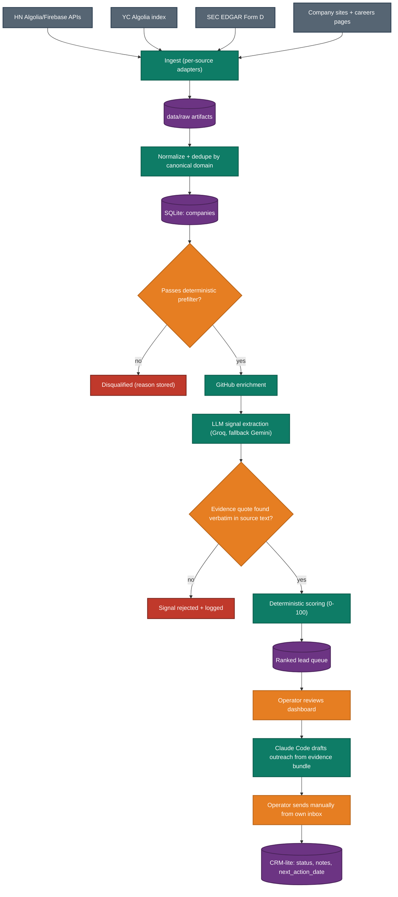
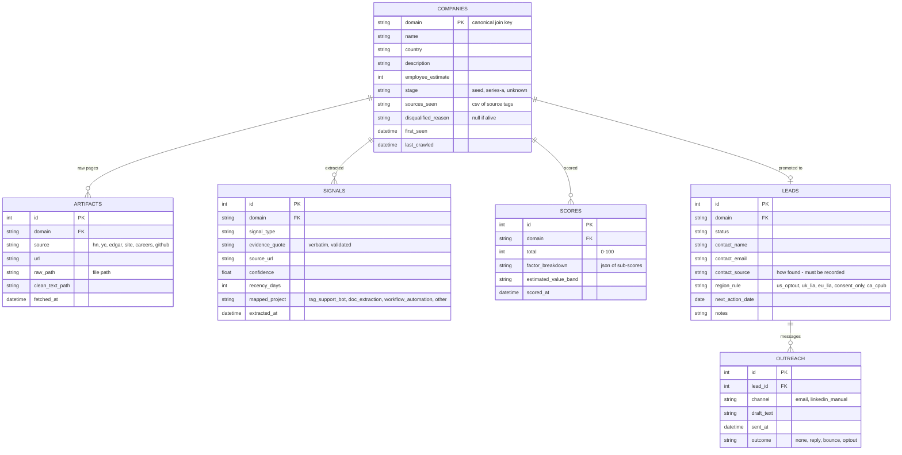
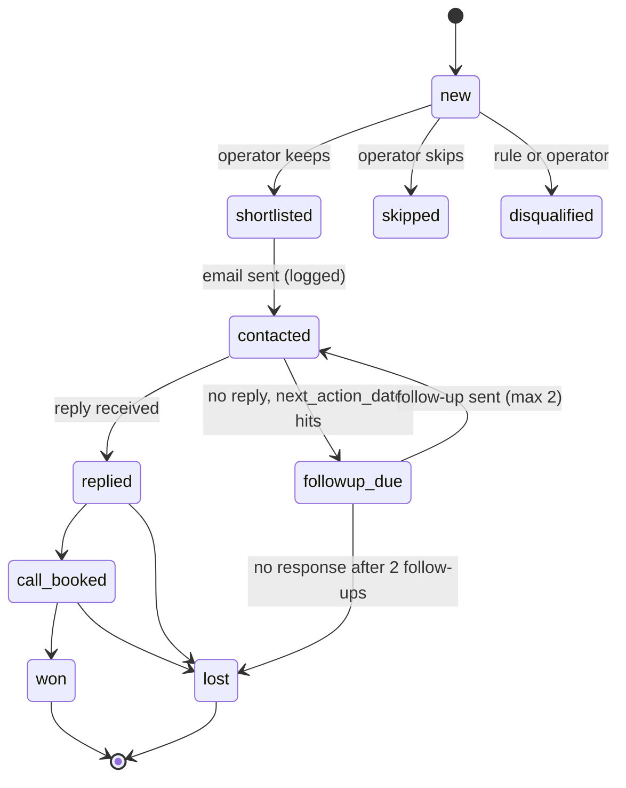
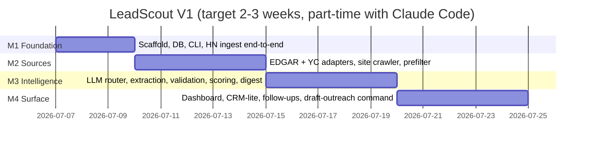

# LeadScout — V1 Specification & Build Plan

| | |
|---|---|
| **Document** | Product + technical specification (composed PRD / tech-spec skeleton) |
| **Owner / Operator** | Solo AI consultant (single user) |
| **Audience** | Claude Code (builder) and the operator |
| **Status** | Approved for build — V1 |
| **Scope legend** | ✅ in scope for V1 · ⚠️ deferred (reason given inline) |
| **Purpose** | Every morning, answer one question: **"Which companies should I contact today, and why?"** |

---

## 1. Mission

Surface **3–5 companies per day** that have a specific, evidence-backed, AI-solvable operational pain, ranked by a transparent score, each with a brief the operator can act on in under five minutes. The product is **timing + a reason to talk**, not a contact database.

Success one-liner: *at least 2 of the top 5 daily leads are companies the operator genuinely wants to email, with a hook they didn't have to invent.*

## 2. Operating constraints

1. **Cost:** $0/month baseline. All data sources are free official APIs or genuinely public pages. LLM extraction runs on free tiers (Groq primary, Gemini fallback). Optional overflow budget ≤ $5–10/month — never required for V1 to function.
2. **Runtime:** operator's laptop. Pipeline is run manually (one CLI command) each morning; no always-on services, no deployment.
3. **Single user.** No auth, no multi-tenancy.
4. **Compliance-first:** official APIs and logged-out public pages only. Never scrape behind a login, never accept-then-breach clickwrap terms, respect robots.txt as if binding, per-domain rate limits. LinkedIn / G2 / Reddit are **manual research only**, never in the pipeline.
5. **Evidence or it didn't happen:** every extracted signal must carry a verbatim quote + source URL, programmatically verified. A lead the system can't explain does not surface.
6. **Region:** English-speaking markets first (US, UK, CA, AU, IE, NZ, SG) plus English-operating startups elsewhere. Per-region outreach rules in §13.

## 3. Product roadmap

The long-term product is seven modules. V1 ships four of them in minimal form.

| # | Module | V1 | V2 | V3 |
|---|---|---|---|---|
| 1 | Lead Discovery (crawl sources, detect signals) | ✅ core | deepen | deepen |
| 2 | Lead Intelligence (why they're a fit) | ✅ basic (signals + score + brief) | ✅ full company audit: website audit, missing chatbot / automation / document-workflow detection | — |
| 3 | Personalization (tailored outreach) | ✅ via Claude Code drafting session | semi-automated | — |
| 4 | CRM (track conversations, statuses) | ✅ lite (status + notes + follow-up date) | response tracking | full pipeline views |
| 5 | Proposal Generator | ⚠️ V3 — needs won/lost data and stable pricing table first | — | ✅ |
| 6 | Demo Generator (micro-demo on prospect's public data) | ⚠️ V3 — highest effort per lead; only justified for warm replies | — | ✅ (built per-lead with Claude Code) |
| 7 | Follow-up Agent | ✅ lite (`next_action_date` + "due today" view) | smart reminders | sequencing |

**V1 (2–3 weeks):** crawl a few sources → detect signals → score → dashboard → outreach draft. Nothing else.
**V2:** per-company deep analysis (audit of their site: support burden, missing AI features, document-heavy workflows) — turns a lead into a diagnosis.
**V3:** proposal + architecture + timeline + price estimate + micro-demo — turns a diagnosis into a sale.

## 4. V1 scope

### In scope ✅

- Sources: HN "Who is hiring" + Show HN, YC directory index, SEC EDGAR Form D, company website/careers crawling, GitHub enrichment, Hunter email verification (free tier, shortlist only).
- Pipeline: ingest → normalize/dedupe by domain → deterministic prefilter → LLM signal extraction with verified evidence → deterministic scoring → daily ranked queue.
- Local dashboard (FastAPI, server-rendered): ranked queue, lead detail with evidence, status buttons, follow-ups due, simple funnel counts.
- Morning workflow incl. a Claude Code slash command that drafts outreach from the evidence bundle.
- Compliance layer: suppression list, per-region rule check before any lead is marked "ready to contact."

### Deferred ⚠️ (each with the reason)

- **Product Hunt** — its API is non-commercial-use only; lead gen for a consulting business is commercial. Requires written permission from PH first. Show HN covers launches meanwhile.
- **Reddit in-pipeline** — free API tier is gated to non-commercial/mod use; commercial tier is paid. Manual reading stays allowed.
- **LinkedIn automation** — ToS-prohibited, litigation-proven risk (hiQ contract judgment). Manual in-browser research only, on shortlisted leads.
- **Email-sending infrastructure (Instantly/Smartlead, warm-up, burner domains)** — at 3–10 highly personalized emails/day sent manually from an established inbox, deliverability is better than any tool, and cost stays $0. Revisit only when daily volume exceeds ~25.
- **Postgres / Redis / queues / workers** — single user on a laptop; SQLite + sequential CLI stages have zero ops cost and no scale problem below ~100k companies.
- **Semantic search / embeddings** — SQLite FTS5 is sufficient at V1 volume; embeddings earn their keep only for "find similar companies" (V2+).
- **Learned scoring** — requires won/lost history that doesn't exist yet; V1 uses fixed weights and records every factor sub-score so V2+ can learn from outcomes.
- **Multi-user / auth / hosting** — single operator, local machine.

## 5. Architecture

### Stack (locked decisions)

| Layer | Choice | One-line reason |
|---|---|---|
| Language | Python 3.12 | Best crawling + LLM ecosystem; Claude Code writes it well |
| Package/deps | `uv` + `pyproject.toml` | Fast, reproducible, no venv ceremony |
| DB | SQLite (via SQLAlchemy 2.x) | Zero ops; SQLAlchemy keeps a Postgres migration path open |
| Raw store | `data/raw/{domain}/{timestamp}_{page}.html` on disk | Cheap, inspectable, re-processable |
| CLI | Typer (`leadscout ingest`, `leadscout analyze`, `leadscout digest`, `leadscout serve`) | One command per pipeline stage + one to run all |
| HTTP | `httpx` + `tenacity` retries | Async-capable, polite timeouts |
| Text extraction | `trafilatura` | Best free main-content extractor |
| Robots | `urllib.robotparser`, cached per domain | Treat robots.txt as binding |
| LLM (extraction) | Groq `llama-3.1-8b-instant` → fallback Gemini Flash-Lite (`responseSchema`) | 14,400 free req/day primary; schema-enforced JSON fallback |
| LLM (outreach drafting) | Claude Code, interactively, during morning review | Already paid for; frontier quality at $0 marginal cost |
| Schemas | Pydantic v2 everywhere (LLM I/O, config) | Validation is the anti-hallucination layer |
| Dashboard | FastAPI + Jinja2 templates (+ a little HTMX) | Server-rendered, no build step, local only |
| Config/secrets | `.env` + `pydantic-settings`; `.env` git-ignored | Keys never in code |
| Scheduling | None in V1 — manual morning run (optionally OS cron/Task Scheduler later) | Laptop isn't always on |

### Pipeline flow



## 6. Data model



Plus two standalone tables: `opt_outs` (email/domain, date, permanent — checked before every send) and `llm_cache` (sha256 of model+prompt → response JSON, hit count).

## 7. Data sources & ingestion

Repeating unit: **Source → Endpoint → Cadence → What to extract → Politeness rules → Status.**

### 7.1 HN "Who is hiring" ✅
- **Endpoint:** Algolia HN Search `https://hn.algolia.com/api/v1/search_by_date?tags=story,author_whoishiring` to find the monthly thread; then Firebase `https://hacker-news.firebaseio.com/v0/item/{id}.json` for the comment tree (top-level comments = job posts).
- **Cadence:** on the 1st of each month and again ~day 10 (late posts). Show HN: daily via `search_by_date?tags=show_hn`.
- **Extract:** company name, URL/domain, roles sought, remote/region, full post text (rich signal text for the LLM stage).
- **Politeness:** official free APIs, no stated rate limit; still cap at 2 req/s.

### 7.2 YC directory ✅
- **Endpoint:** the public client-side Algolia index (app `45BWZJ1SGC`, index `YCCompany_production`) queried exactly as the site's own frontend does. **Fragile by design** — the key can rotate; adapter must fail gracefully and re-extract the current key from the page when it does.
- **Cadence:** weekly refresh of the 4 most recent batches.
- **Extract:** name, domain, batch, one-liner, team size, location, tags.

### 7.3 SEC EDGAR Form D ✅ (funding engine, US)
- **Endpoint:** EDGAR full-text search API (`efts.sec.gov`) filtered to form type D, plus daily index files under `sec.gov/Archives/edgar/daily-index/`. Claude Code: verify exact query params against current docs at build time.
- **Cadence:** daily poll (weekday mornings).
- **Extract:** company name, state, offering amount, date of first sale, industry group, related persons (execs).
- **Politeness (mandatory per SEC fair-access policy):** descriptive `User-Agent: LeadScout/0.1 (operator email)`; ≤ 10 req/s; prefer bulk/daily files over hammering search.

### 7.4 Company websites & careers pages ✅
- **Pages per company:** homepage, `/careers|/jobs`, `/pricing`, `/blog|/changelog`, `/help|/faq|/docs` (first match of each, follow at most 1 level of obvious links, ≤ 8 pages/company).
- **Cadence:** once on discovery; re-crawl only when a lead is shortlisted.
- **Extract:** clean main text per page via trafilatura → stored as artifact; this text is the primary input to LLM extraction.
- **Politeness:** robots.txt honored (skip disallowed paths and log it); ≥ 2 s between requests to the same domain; 10 s timeout; identify honestly in User-Agent; **no headless browser in V1** (JS-only sites are skipped and marked, Playwright is a V2 decision).

### 7.5 GitHub enrichment ✅ (shortlist only)
- **Endpoint:** REST API with a personal access token (5,000 req/hr).
- **Trigger:** only for companies that passed the prefilter.
- **Extract:** org exists?, repo count, primary languages, any ML/AI repos or dependencies, recent activity → feeds the `engineering_maturity` hint.

### 7.6 Hunter email verification ✅ (budget-guarded)
- **Endpoint:** Hunter API (free tier, works on free plan).
- **Trigger:** only when the operator shortlists a lead. Guess `first@domain`-style patterns, verify via Hunter. Hard monthly budget guard at 50 calls; warn at 40.

### 7.7 Manual-only sources (never automated)
LinkedIn (decision-maker + headcount check), G2/Capterra/Trustpilot (complaint mining), Reddit (pain posts) — the dashboard's lead-detail page links directly to pre-filled searches on these so manual research takes seconds, but the pipeline never fetches them.

## 8. Pipeline stages

Repeating unit: **Stage → Input → Logic → Output → Cost.**

| Stage | Input | Logic | Output | Cost |
|---|---|---|---|---|
| 1 Ingest | Source APIs/pages | Per-source adapter, idempotent upserts | Artifacts + candidate companies | $0 |
| 2 Normalize | Candidates | Resolve to canonical domain (strip www, follow one redirect); merge duplicates across sources | One row per company | $0 |
| 3 Prefilter | Company + artifacts | Deterministic rules below | alive / disqualified(reason) | $0 |
| 4 Enrich | Survivors | GitHub lookup, heuristic size/country from site text | Filled company facts | $0 |
| 5 Extract | Clean page text + job posts | LLM (§9), strict JSON schema, rubric prompt | Validated signals | Free tier |
| 6 Score | Signals + facts | Deterministic formula (§10) | Score + factor breakdown + value band | $0 |
| 7 Digest | Top N by score | Compose brief: facts, signals w/ quotes, score reasons, research links | `data/digest/YYYY-MM-DD/` briefs + dashboard queue | $0 |

**Prefilter rules (all deterministic, each failure records its reason):** has a resolvable live domain; site language is English; employee estimate < 500 (or unknown); not an agency/consultancy/dev-shop (keyword heuristic — they're competitors, not clients); not in `opt_outs` or previously disqualified; country not in the hard-exclude list (§13); at least one artifact with ≥ 500 chars of clean text.

**Daily throughput sanity check:** ~200 new companies/day × ~2–3 LLM calls each ≈ 400–600 requests — ~4% of Groq's 14,400/day free quota for `llama-3.1-8b-instant`. Free tier is not a bottleneck at V1 scale.

## 9. LLM layer

**Routing:** Groq `llama-3.1-8b-instant` (temp 0, JSON mode) → on invalid JSON or API failure, one retry → Gemini Flash-Lite with `responseSchema` → if both fail, mark company `needs_manual_review`. All calls go through one internal `llm_complete()` interface; responses cached in `llm_cache` keyed on sha256(model + full prompt) so re-runs are free.

**Extraction output schema (Pydantic-enforced):**

```json
{
  "company_domain": "example.com",
  "company_facts": {
    "what_they_do": "one sentence",
    "employee_estimate": 40,
    "country": "US",
    "engineering_maturity": "low|medium|high"
  },
  "signals": [
    {
      "signal_type": "stalled_ai_hire | explicit_ai_intent | ai_roadmap_gap | support_burden | manual_workflow | ops_heavy_hiring | doc_heavy_business | funding_event",
      "evidence_quote": "verbatim substring of the provided text",
      "source_url": "https://...",
      "confidence": 0.85,
      "recency_days": 14,
      "mapped_project": "rag_support_bot | doc_extraction | workflow_automation | other"
    }
  ]
}
```

**Anti-hallucination validation (hard rule):** `evidence_quote` must be found verbatim (whitespace-normalized) inside the source text that was actually sent to the model, and `source_url` must be one of the URLs provided in that prompt. Any signal failing either check is dropped and logged. This single rule is what makes the whole system trustworthy.

**Rubric prompt (maintained as a versioned file `prompts/extract_v1.md`):** defines each signal type with 2 positive and 2 negative examples, instructs "return an empty signals list when nothing qualifies — most companies have no signal," and forbids inference beyond the text.

**Privacy rule:** free tiers may train on inputs (Gemini free explicitly does). Pipeline inputs are public web text — acceptable. **Never** send client-confidential or private personal data through free tiers.

## 10. Scoring

Deterministic, transparent, 0–100. Every factor's sub-score is stored so the dashboard can explain any ranking and V2 can learn from outcomes.

| Factor | Weight | Scoring sketch |
|---|---|---|
| AI-opportunity fit | 30 | Strength × confidence of best signal; multiple *independent* signal categories add a corroboration bonus (+ up to 5); mature in-house ML slashes it |
| Timing / urgency | 25 | Decay curve on recency of the strongest trigger: < 30 days full points, ~0 after 180 days |
| Company size fit | 15 | Peak at 10–200 employees; taper to 0 at 500+ or 1–2 person companies |
| Funding / budget evidence | 15 | Form D or announced raise < 90 days = full; < 1 yr = half; none = 0 (not disqualifying) |
| Reachability | 15 | Findable founder/CTO + public contact path + permissive region rule |

**Hard disqualifiers (score forced to 0, reason stored):** no AI-shaped opportunity at all; consent-only region with no consent path; on the suppression list; agency/competitor; > 500 employees or visibly large internal AI team.

**Estimated value band** (shown on the card, used in V3 proposals) comes from `mapped_project` × size, per §14.

## 11. Dashboard & CRM-lite

Local app at `localhost:8000` (`leadscout serve`). Four views, nothing more:

1. **Queue (home):** today's ranked cards — company, score, top 2–3 signals with recency badges ("Form D filed 9 days ago"), value band, one-line why. Actions per card: Shortlist / Skip / Disqualify. Five-second decisions.
2. **Lead detail:** full evidence (quotes linked to source URLs), factor-by-factor score breakdown, company facts, pre-filled manual-research links (LinkedIn/G2/Reddit searches), contact fields, region rule + compliance checklist, status buttons, notes, `next_action_date`.
3. **Follow-ups due:** leads whose `next_action_date` ≤ today. This is the V1 Follow-up Agent.
4. **Funnel:** plain counts — surfaced → shortlisted → contacted → replied → call → won — plus conversion by signal type (feeds future re-weighting). No vanity metrics.

**Lead lifecycle:**



## 12. Morning workflow (the human loop)

1. `leadscout run` (ingest → analyze → digest; target < 15 min wall-clock).
2. Open dashboard, triage queue (~5 min), shortlist 3–5.
3. For each shortlisted lead: 2-minute manual check (LinkedIn person, site sniff), fill contact via Apollo free UI / Hunter verify.
4. In Claude Code: `/draft-outreach <domain>` — a repo slash command (`.claude/commands/draft-outreach.md`) that reads the lead's evidence bundle from the DB/digest and drafts: 90–120-word cold email referencing ONE verified signal, one clear CTA, plus a tighter LinkedIn variant, plus the compliance footer for the lead's region. Operator edits, then sends **manually from their own inbox**.
5. Log send in dashboard (sets status + `next_action_date` = +4 business days).

## 13. Outreach compliance rules (enforced per lead before "ready to contact")

| Region | Basis | Hard requirements baked into every draft |
|---|---|---|
| US | CAN-SPAM (opt-out) | Accurate From/subject, physical postal address, working opt-out line, honor within 10 days |
| UK | PECR corporate-subscriber + UK GDPR legitimate interest | Documented one-page LIA (kept in repo `compliance/`), opt-out in every mail, sole traders treated as consent-required |
| EU (LI-friendly states) | GDPR legitimate interest | LIA, strictly role-relevant message, instant opt-out honoring; when a state's rule is unknown → treat as consent-only |
| EU consent-only (seed list: DE, AT — verify per country before first send) | Consent | **Do not cold-email. Excluded by prefilter** unless consent exists |
| Canada | CASL conspicuous-publication exception | Only if business email was published without a no-contact statement AND message relates to their role; record the basis on the lead |
| AU/NZ/SG | Consent/inferred-consent regimes | Same conspicuous-publication discipline as Canada |

Global rules: suppression list checked before every send; every opt-out recorded permanently; one thread + max 2 follow-ups per lead; identity always accurate; `contact_source` recorded for every address (GDPR provenance).

## 14. Project value benchmarks (2026, freelance/boutique — from research)

Used for the value band on lead cards now, and V3 proposal pricing later.

| Project archetype | Startup (<~100 ppl) | Mid-market | Typical timeline |
|---|---|---|---|
| RAG support chatbot | $5k–$20k | $25k–$75k | 2–5 wks / 6–12 wks |
| Document-extraction pipeline | $7.5k–$25k | $30k–$100k | 3–6 wks / 2–4 mo |
| Workflow automation / AI agent | $3k–$20k | $25k–$100k | 1–4 wks / 6–16 wks |

Entry motion: paid pilot $500–$3k → scoped build → 15–25%/yr maintenance retainer. Compliance-heavy industries (+20–50%) and ERP/CRM integration (+$10k–$50k) are upsells.

## 15. Engineering conventions & guardrails

- Repo layout: `leadscout/` package (`sources/`, `pipeline/`, `llm/`, `scoring/`, `web/`, `models.py`, `cli.py`), `prompts/`, `compliance/`, `data/` (git-ignored), `tests/`.
- Every source adapter implements the same interface (`fetch() -> list[Artifact]`) so adding sources is additive.
- Idempotency everywhere: re-running any stage never duplicates rows.
- Structured logging to `data/logs/` (per-run summary: fetched, extracted, rejected quotes, LLM calls used vs quota).
- Smoke tests (pytest) per adapter with recorded fixtures — no live calls in tests.
- `ruff` for lint/format. Type hints on public functions.
- Secrets only in `.env` (`GROQ_API_KEY`, `GEMINI_API_KEY`, `GITHUB_TOKEN`, `HUNTER_API_KEY`, `OPERATOR_EMAIL`, `POSTAL_ADDRESS`).
- Budget guards in code: Groq daily counter, Hunter monthly counter, hard stop + warning at 90%.
- Crawler ethics are non-negotiable and implemented centrally (one `polite_fetch()` used by all adapters).

## 16. V1 build milestones



**Acceptance per milestone:**
- **M1:** `leadscout ingest hn` pulls the current Who-is-hiring thread into SQLite; companies table populated with real rows; tests pass.
- **M2:** `leadscout ingest all` runs all adapters politely; ≥ 100 real companies normalized + prefiltered with reasons visible.
- **M3:** `leadscout analyze` produces validated signals (spot-check: zero fabricated quotes) and scored companies; `leadscout digest` writes today's ranked briefs; quota counters accurate.
- **M4:** full morning workflow works end-to-end on real data; operator triages, drafts via `/draft-outreach`, logs a send; follow-up appears on due date.

## 17. Success criteria (V1)

1. ≥ 2 of the top 5 daily leads are ones the operator genuinely wants to contact, with an evidence-backed hook.
2. Morning routine ≤ 30 minutes including sends.
3. Running cost $0 (LLM free tiers, no paid data).
4. Zero fabricated evidence quotes surviving validation (spot-checked weekly).
5. Every contacted lead has a recorded region rule, contact source, and opt-out path.

## 18. Pre-build checklist (operator, ~30 min, all free)

1. Install: Python 3.12, `uv`, git. Create empty repo, drop this spec in as `SPEC.md`.
2. Get free API keys: Groq (console.groq.com), Google AI Studio (Gemini), GitHub personal access token, Hunter.io free account. Put in `.env`.
3. Decide the postal address + operator email that go in the compliance footer.
4. Optional, not required: ~$10 one-time OpenRouter credit purchase unlocks 1,000 free req/day as a third LLM fallback.

## 19. V2 / V3 preview (do not build yet)

**V2 — Lead Intelligence deep-dive:** per-company audit report (help-center size → chatbot case; forms/turnaround language → automation case; document-heavy flows → IDP case), competitor-AI-gap check, Playwright for JS-heavy sites, response tracking, smarter follow-up agent, re-weight scoring from funnel data.
**V3 — Sales machine:** proposal generator (uses §14 pricing + won/lost history), micro-demo generator (Claude Code builds a tiny working prototype on the prospect's public data per warm reply), timeline/architecture auto-drafts, full CRM views.
